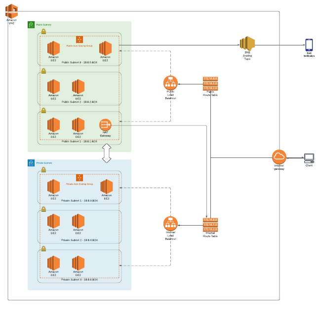

# VPC_and_EC2_Terraform_Deployment
AWS deployment of EC2 and VPC resources using Terraform (IAC)
***
***
# AWS Resources Created:

* VPC
* Subnets
* Security Groups
* Route Tables
* Internet and NAT Gateways
* Auto-Scaling Groups
* more...

# State management
I used Terraform Cloud for state management. This project consists of 2 Terraform Cloud workspaces.
I stored a few of the variable definitions in Terraform Cloud, however most definitions are stored in the ```.auto.tfvars``` files.
### vpc-and-ec2-vpc
* This workspace is for the VPC/base infrastructure resources and acts as the root folder 
* This workspace uses the files from the infrastructure folder
### vpc-and-ec2-platform
* This workspace is for the other resources (EC2,SNS,Etc...). It pulls outputs from the "vpc-and-ec2-vpc" workspace.
* This workspace uses the files from the platform folder

# Resources used
* I used this this Udemy course as a guide for the project:  https://www.udemy.com/course/vpc-solutions-with-ec2-for-production-aws-with-terraform
* This was a guided project however I was able to cement a few key AWS concepts in my brain with the hands on experience I gained from this.
* I also used the Terraform AWS docs:  https://registry.terraform.io/providers/hashicorp/aws/latest/docs
